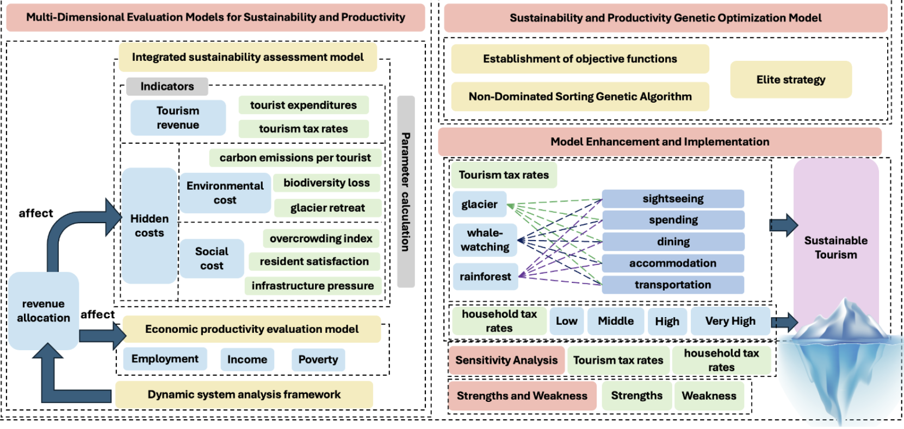

# 🌏 Sustainable Tourism Optimization Model | 可持续旅游优化模型

A multi-objective mathematical modeling framework for balancing economic growth, environmental protection, and social well-being in tourism management.  
基于多目标优化的数学建模框架，用于平衡旅游业的经济增长、环境保护与社会福利，实现可持续旅游管理。

<!-- Banner -->
<div align="center">
  
</div>

<!-- Badges -->
<div align="center">
  
  
  
</div>

---

## 🗂️ Project Overview | 项目概览

This project presents two integrated models for sustainable tourism management using **Juneau** as a case study:  

1. **Sustainability & Productivity Evaluation Model (SPEM)** – Evaluates tourism’s economic, environmental, and social impacts through a weighted index system.  
2. **Sustainability & Productivity Genetic Optimization Model (SP-GOM)** – Uses **NSGA-II** for dual-objective optimization of economic productivity and sustainability.

We focus on four research goals:

- 📈 Quantifying economic benefits, environmental costs, and social costs of tourism  
- 🧮 Optimizing tourism tax rates for different routes and activities  
- 🌿 Designing adaptive models for various destinations (e.g., Bali, Santa Barbara)  
- 🔍 Performing sensitivity analysis to identify the most influential parameters  

本项目以阿拉斯加朱诺市为案例，建立了两大模型：  

1. **可持续性与生产力评估模型（SPEM）**——通过加权指标体系评估旅游的经济效益、环境成本与社会成本  
2. **可持续性与生产力遗传优化模型（SP-GOM）**——采用 **NSGA-II** 进行经济生产力与可持续性的双目标优化

研究任务包括：

- 量化旅游的经济收益、环境成本与社会成本  
- 针对不同路线与活动优化旅游税率  
- 构建可迁移至其他目的地的自适应模型（如巴厘岛、圣巴巴拉）  
- 通过敏感性分析识别影响最大的因素  

---

## 📦 Installation | 安装方式

```bash
git clone https://github.com/YourRepoName/Sustainable-Tourism-Model.git
cd Sustainable-Tourism-Model
pip install -r requirements.txt
## 📊 Dataset Description | 数据集说明

The dataset integrates tourism, environmental, and socio-economic indicators for **Juneau** and adapted scenarios for **Bali** and **Santa Barbara**.

### 1️⃣ Tourism Flow Data | 旅游流量数据
- Annual number of visitors and their distribution across three main routes: **Glacier**, **Whale Watching**, and **Rainforest**.
- Route-specific breakdown by five expenditure categories: sightseeing, shopping, dining, accommodation, and transportation.
- Seasonal variation and long-term trends from 2011–2023.

### 2️⃣ Economic Data | 经济数据
- Average tourist expenditure per route and per activity type.
- Government tourism tax rates for different consumption paths.
- Household income distribution across low, middle, high, and very high categories.
- Poverty rate change and employment capacity data.

### 3️⃣ Environmental Indicators | 环境指标
- **Carbon emissions per capita** for each tourism route.
- **Biodiversity loss index**, with mitigation effects modeled through revenue allocation.
- **Glacier retreat data** for Mendenhall Glacier, including annual degradation rates.
- City-wide environmental carrying capacity estimates.

### 4️⃣ Social Indicators | 社会指标
- **Overcrowding index**: ratio of tourist numbers to route capacity.
- **Resident satisfaction** scores, linked to infrastructure investment and congestion.
- **Infrastructure pressure index**: utilization rates of transportation, energy, and public facilities.

### 5️⃣ Adapted City Datasets | 其他城市适配数据
- **Bali**: Volcano path, beach path, cultural tour data, including coral reef degradation and infrastructure capacity.
- **Santa Barbara**: Beach, cultural tour, and hiking routes, with indicators for sea-level rise and marine pollution.

---

本数据集整合了 **朱诺市（Juneau）** 的旅游、环境与社会经济指标，并对 **巴厘岛（Bali）** 和 **圣巴巴拉（Santa Barbara）** 进行了适配。

### 1️⃣ 旅游流量数据
- 年度游客总数及其在三条主要路线（冰川、观鲸、雨林）上的分布情况。
- 按五类消费项目（观光、购物、餐饮、住宿、交通）细分的路线支出数据。
- 2011–2023 年的季节性变化与长期趋势。

### 2️⃣ 经济数据
- 每条路线及各活动类型的游客平均消费额。
- 各旅游消费路径对应的政府旅游税率。
- 居民收入分布（低收入、中等收入、高收入、极高收入）。
- 贫困率变化与就业容量数据。

### 3️⃣ 环境指标
- 各旅游路线的**人均碳排放量**。
- **生物多样性损失指数**（模型中通过财政收入分配进行缓解）。
- 门登霍尔冰川的**消融数据**，包括年度退缩率。
- 城市整体环境承载力估算值。

### 4️⃣ 社会指标
- **拥堵指数**：游客人数与路线容量的比值。
- **居民满意度**：与基础设施投资和拥堵程度相关。
- **基础设施压力指数**：交通、能源和公共设施的利用率。

### 5️⃣ 适配城市数据
- **巴厘岛（Bali）**：火山路线、海滩路线、文化游路线的数据，包含珊瑚礁退化与基础设施容量指标。
- **圣巴巴拉（Santa Barbara）**：海滩、文化游、徒步路线的数据，包含海平面上升与海洋污染指标。

---

## 🔬 Implementation of Research Objectives | 研究目标实现过程

### 1️⃣ Sustainability & Productivity Evaluation Model (SPEM)
- **Tourism Revenue** – Calculated from route-specific expenditures and tax rates.  
- **Environmental Cost** – Based on carbon emissions, biodiversity loss, and glacier retreat.  
- **Social Cost** – Includes overcrowding, resident satisfaction, and infrastructure pressure.  
- **Dynamic System Framework** – Feedback loop + dynamic programming to simulate long-term effects.  

### 2️⃣ Sustainability & Productivity Genetic Optimization Model (SP-GOM)
- **Algorithm** – NSGA-II multi-objective optimization.  
- **Decision Variables** – 15 tourism tax rates (3 routes × 5 activities).  
- **Objectives** – Maximize sustainability index (Z) and economic productivity index (EPI).  
- **Pareto Frontier** – Select optimal balance between economic and environmental goals.  

### 3️⃣ Sensitivity Analysis
- Evaluated the impact of tax adjustments on tourist flows by route.  
- Derived price elasticity coefficients for each tourism route.  

### 4️⃣ Model Adaptability
- Applied to **Bali** and **Santa Barbara** with modified routes and environmental constraints.  
- Produced route-specific tax strategies and sustainability simulations.  

---

## 🧱 Project Structure | 项目结构

```bash
├── data/                              # Tourism, environmental, and socio-economic datasets
├── models/                            # SPEM and SP-GOM implementation
├── optimization/                      # NSGA-II algorithm code
├── sensitivity_analysis/              # Sensitivity analysis scripts
├── results/                           # Pareto frontier plots, simulation outputs
├── requirements.txt                   # Python dependencies
├── LICENSE
├── README.md
